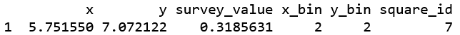
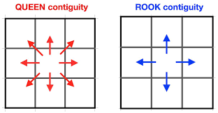
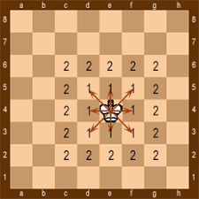

Le code qui suit présente une proposition d'implémentation d'une agrégation géographique avec contrainte de contiguïté prenant en compte un critère d'arrêt sur la taille du nombre de répondants d'une enquête pour chaque agrégat, lors du processus d'agrégation.

Ce code pouvant très bien s'adapter sur des données réelles est effectué sur des données simulées pour éprouver les possibilités de notre approche. La forme des données simulées permet de saisir le format attendu sur les données réelles pour une éventuelle application. Ce projet ne propose pas une mise en production mais une proposition méthodologique de l'implémentation d'une telle méthode.

## Import des packages

```{r setup, results = FALSE,results='asis', comment=NA, warning=FALSE, message=FALSE}
library(ggplot2) # package pour affichage graphique de la grille
library(dplyr) # package pour manipuler les données
library(igraph) # package pour la manipulation de graphe
# package pour manipulation avancée de dendrogramme
if(!require(dendextend)) install.packages("dendextend")
library("dendextend")
```

# Simulation des communes : génération de carrés aléatoires

## Paramétrage de la grille de carrés

```{r}
#dimension de l'espace géographique simulé
x_max <- y_max <- 18
# nombre total de carrés dans la grille
n_squares <- 81
# effectif de la population d'individus à générer
n <- n_squares*100 # pour qu'en moyenne un carré comporte au moins 100 habitants
# nombre de colonnes de carrés
nb_cols_squares <- sqrt(n_squares) 
square_side_length <- x_max/nb_cols_squares # longueur des côtés d'un carré
```

## Génération des individus et de la grille

### Génération des individus et données de contexte

On génère d'abord des individus aléatoirement dans le plan et générant au hasard des couples (x,y)
représentant les individus.

Pour pouvoir observer les mêmes individus à chaque fois que l'on souhaite recommencer la simulation,
on fixe ce qu'on appelle une graine d'aléatoire.

```{r}
set.seed(123) # fixer la graine d'aléatoire pour obtenir les mêmes résultats aléatoires à chaque exécution
```

Si l'on ne souhaite pas donner de structure démographique particulière, nous pouvons générer nos individus selon une loi uniforme dont les données sont gardées dans un tableau comme ceci: (la cellule suivante ne sera pas exécutée avec "eval = FALSE")

```{r ,eval=FALSE}
# génération aléatoire d'individus dans le plan
df <- data.frame(x = runif(n, 0, x_max),
                 y = runif(n, 0, y_max))

```

Or, pour simuler la réalité, il est souhaitable d'avoir d'une forte concentration sur plusieurs parties de la grille comme pour les métropoles et des zones avec une densité faible de population à d'autres endroits.

Pour générer aléatoirement des individus dans le plan avec une forte concentration dans certaines zones, nous définissons un certain nombre de zones métropolitaines. Par défaut, nous choisissons 2 fois le nombre de carrés par ligne pour avoir un nombre de métropoles proportionnel à la dimension de la grille et recouvrir une large partie du plan.

Nous faisons tout de même en sorte d'avoir au moins un habitant par commune. En 2020, on ne réfère environ que 6 communes sans population légale. Nous prenons donc une variance suffisamment large pour la distribution d'individus générés de sorte à recouvrir le territoire tout en imposant une certaine structure démographique

Le code suivant commence par placer un unique point dans chaque carré de la grille de carrés. Ensuite, il choisit aléatoirement les positions des métropoles, et ajoute des individus autour de ces centres pour obtenir une dispersion aléatoire des individus. Enfin, il combine les deux dataframes pour obtenir un tableau de n lignes.

```{r , eval=TRUE}
# Génération de métropoles éloignées

# Définir le nombre de métropoles à générer
metropoles <- nb_cols_squares*2 # pour avoir un certain nombre de métropoles proportionnels au dimension de la grille
num_carr <- nb_cols_squares # nombre de carrés par côté

# On génère quelques point dans chaque carré
# Coordonnées des centres de chaque carré
x_centers <- rep(1:x_max) - 0.5
y_centers <- rep(1:y_max) - 0.5

# Placer un individu au centre de chaque carré
df <- data.frame(
  x = rep(x_centers),
  y = rep(y_centers)
)

# Tirer au sort les positions des métropoles
metropole_centers <- data.frame(
  x = sample(x_centers, metropoles, replace=FALSE),
  y = sample(y_centers, metropoles, replace=FALSE)
)

# Ajouter du bruit à ces métropoles pour obtenir une dispersion aléatoire des individus autour de ces centres
df_metropole <- data.frame(
  x = abs(c(rnorm(n - metropoles, metropole_centers$x[1:metropoles], x_max/10 ))),
  y = abs(c(rnorm(n - metropoles, metropole_centers$y[1:metropoles], y_max/10 )))
)

# Combiner les deux dataframes pour obtenir le tableau final
# on complète df par df_metropole en faisant sorte qu'on obtient bien n lignes au final
df <- rbind(df, df_metropole[1:pmax(n-dim(df)[1],0),])

# Assurer que les valeurs de x et y sont positives et ne dépassent pas x_max et y_max : respect des limites du plan
df$x <- pmin(df$x, x_max)
df$x <- pmax(df$x, 0)
df$y <- pmax(df$y, 0)
df$y <- pmin(df$y, y_max)

# Si l'on souhaite éviter une concentration au bord de la grille
# Remplacer le minimum par une valeur aléatoire entre 0 et x_max si le minimum est x_max
#if(min(df$x) == x_max) {
  #df$x[df$x == x_max] <- runif(1, 0, x_max)
#}
```

Nous générons les données de contexte des communes i.e une valeur aléatoire est affectée à chaque commune (carré) de notre simulation

```{r}
# génération des données de contexte
square_values <- runif(n_squares, 0, 1) # valeurs aléatoires pour chaque carré
```

Bien que cela ne soit pas utile dans notre étude, nous pouvons générer une valeur aléatoire pour chaque individu (point) qui représente une donnée individuelle pouvant être une donnée d'enquête

```{r}
#générer une valeur aléatoire pour chaque point (individu d'enquête) dans les coordonnées
df$survey_value <- runif(n, 0, 1)
```

```{r}
#résumer et afficher un tableau de synthèse de ces données
summary(df)
```

### Génération de la grille 

Nous découpons le plan en fonction de la longueur des côtés de chaque carré et la dimension du plan.
Il faut donc dans la partie "Paramétrage de la grille de carrés", choisir des dimensions cohérentes à la situation que l'on souhaite modéliser.

```{r}
#découper les coordonnées en carrés de taille square_side_lengthxsquare_side_length
#la fonction cut sert à découper les coordonnées en intervalles de taille prédéterminée
#la fonction seq sert à générer une séquence d'éléments dans un ordre donné
df$x_bin <- cut(df$x, breaks = seq(0, x_max, by = square_side_length), labels = FALSE)
df$y_bin <- cut(df$y, breaks = seq(0,y_max, by = square_side_length), labels = FALSE)

# Assignation d'un numéro ou indice à chaque carré. Ex: carré n°1 est le carré le plus haut à gauche
# en numérotant les carrés, l'identifiant de chaque carré s'obtient à partir des coordonnées x_bin et y_bin (expression modulo)
df$square_id <- df$x_bin + nb_cols_squares * (df$y_bin-1) #petite réflexion mathématique
#ex: le carré n°6 se déduit avec x_bin=1,y_bin=2 par 6=1+2(5) on se déplace de 1 à droite et sachant qu'il faut se deplacer de 5 pas à droite avant d'arriver en bas, on s'est déplacé 2 cases en bas.
```

Nous raisonnons aussi sur les numéros que l'on donne aux communes. La convention que nous avons choisie est de numéroter les carrés de gauche à droite et de haut en bas.

Exemple pour une grille de 25 carrés de dimension 4x4 dans un plan de dimension 20x20:


Pour un individu, x_bin correspond à la colonne de carré correspondante.
y_bin correspond à la ligne de carré correspondante.

Par exemple, un individu à la position (x=6,y=7) se trouve dans la deuxième colonne de carré (x_bin=2) car un carré a un côté de longueur 4 et dans la deuxième ligne de carré (y_bin=2). En observant la grille, cela correspond au carré n°7.



Chaque carré ayant un identifiant, nous pouvons lui affecter une donnée de contexte.

```{r}
#Ajout de la colonne correspondant à la valeur de chaque carré
df$square_value <- square_values[df$square_id]
```


La grille est donc bien modélisée selon le tableau suivant :

```{r}
head(df)
```

Voici à quoi pourrait typiquement ressembler les données sur lesquelles on souhaiterait appliquer une agrégation géographique avec contrainte de contiguïté.

# Représentation graphique de notre grille

L'image est considérée comme trop grande à partir d'une grille de dimension 10x10. La grille sera tout de même modélisée mais il faudra adapter sa RAM si l'utilisateur tient à afficher la grille complète des individus simulés.

```{r ,echo=FALSE} 
p_numerote <- ggplot(df, aes(x, y)) +
  geom_bin2d(bins = n_squares) +
  coord_fixed(ratio = 1) +
  labs(x = "", y = "") +
  theme_classic() +
  scale_y_reverse() +
  theme(plot.background = element_rect(fill = "white"),
        panel.grid.major = element_blank(),
        panel.grid.minor = element_line(color = "black",size = square_side_length/x_max,linetype = 1),
        axis.line = element_blank(),
        axis.text = element_blank(),
        axis.ticks = element_blank(),
        plot.margin = unit(c(0, 0, 0, 0), "cm")) +
  # numérotation des carrés
  geom_text(aes(x = (x_bin - 0.5) * square_side_length, 
                y = (y_bin - 0.5) * square_side_length,
                label = square_id, size=6), 
            color = "red", 
            size = 5,
            family = "sans",
            hjust = 0.5,
            vjust = 0.5)

# Enregistrement du graphique en tant qu'image
ggsave("survey_data_square_with_ID.png", plot = p_numerote, width = n_squares, height = n_squares,limitsize = FALSE)
#Affichage de la grille
p_numerote
```

# Mise en forme du tableau : Traitement des données simulées pour être fournies en entrée à notre algorithme d'agrégation

Nous renommons et filtrons les variables pertinentes pour une meilleure compréhension dans le contexte du problème. Nous n'avons besoin que des données des contexte et les identifiants des communes. Il nous reste le nombre de répondants à l'enquête par commune.

```{r}
#Restitution du tableau final qui va être utilisé
df$coords <- paste(df$x, df$y, sep = ",")
#Filtrer les données et renommer les colonnes
donnees <- dplyr::select(df,square_value,square_id)
colnames(donnees) <- c("donnee_contexte_commune", "ID")
```

## Modélisation des enquêtés

### Indicatrice de réponse à l'enquête

Nous simulons le fait que des individus ont répondu à une enquête dans chaque carré les individus qui ont répondu à une enquête en effectuant un tirage de Bernoulli selon la variable correspondant aux données de contexte. Cela permet de modéliser le fait que plus la variable d'intérêt est grande plus il y a de chances d'avoir de répondants.

**Première option** : Nous tirons simplement des individus au hasard sur tout le territoire.
**Deuxième option** : Nous effectuons un échantillonage à deux degrés en ayant pour unité primaire les communes et comme unité secondaire les individus.

Nous privilégions la seconde option qui est davantage dans l'esprit du papier *Un algorithme de regroupement d'unités statistiques selon certains critères de similitude* écrit par Michel Isnard et Marc Christine. De plus, il y a un gain potentiel de variance par rapport à un échantillonnage directement sur les individus du territoire métropolitain français, en particulier si la variable d'intérêt varie considérablement entre les communes. Nous nous assurons alors que l'échantillon obtenu est représentatif des différentes strates de la population étudiée (les communes dans ce cas), ce qui peut permettre de réduire la variance de l'estimateur de la moyenne ou de la proportion.

Autre avantage du tirage à deux degrés: améliorer l'estimation de la taille des unités primaires, dans ce cas les communes (ou carrés). Nous verrons en quoi cela peut-être intéressant lors de l'implémentation de la distance de similarité.

Nous créons donc une variable binaire "inclusion_enquete" qui renseigne si un individu est sélectionné dans l'enquête.

####  Implémentation de la première option de tirage (non exécutée: eval=FALSE)

```{r ,eval=TRUE}
# Effectuer le tirage de Bernoulli selon les données de contexte pour chaque carré
donnees$inclusion_enquete <- rbinom(nrow(donnees), 1, donnees$donnee_contexte_commune)

# Calculer la probabilité d'inclusion pour chaque individu
prob_inclusion <- ave(donnees$inclusion_enquete, donnees$ID, FUN = function(x) sum(x)/length(x))
donnees$proba_inclusion_enquete <- prob_inclusion[donnees$ID]

# Afficher les carrés inclus dans l'échantillon
echantillon <- donnees[donnees$inclusion_enquete == 1, ]
cat("Le nombre d'individus enquêté est de", dim(echantillon)[1])

```

####Implémentation de la seconde option de tirage

```{r,eval =FALSE}
# Nombre d'unités primaires à tirer, ici les communes
n_up_sample <- 10

# Tirage des unités primaires au hasard
set.seed(123) # pour reproduire les résultats
up_sample <- sample(unique(donnees$ID), n_up_sample)

# Sous-échantillonnage des unités secondaires pour chaque unité primaire sélectionnée
donnees_subsampled <- donnees %>%
  filter(ID %in% up_sample) %>%
  group_by(ID) %>%
  sample_n(ceiling(0.5 * n()))

# Calcul des probabilités d'inclusion pour chaque unité secondaire
donnees_subsampled$proba_inclusion <- donnees_subsampled$donnee_contexte_commune


```

### Définition des zones d'absence d'enquêté

Nous définissons des zones très vides au niveau de l'enquête pour observer comment ces zones particulières seront agrégées. L'intérêt est d'observer s'il est possible d'obtenir un gros agrégat sans répondants. Que faire si cela arrive ? Il semble que cela n'arrive pas pour notre algorithme.

Nous définissons la zone manuellement pour être sûr d'avoir un bloc d'absence de répondants mais il est possible d'automatiser en prenant un certain nombre de communes voisines ne se trouvant pas en métropole ou dans d'autres zones souhaitées. Si c'est ce que l'on souhaite, l'utilisateur doit créer une variable d'appartenance à une métropole et reprendre le principe de notre ligne de code ci-dessous.
On souhaite qu'en donnant une proportion

```{r}
# Remplacer la variable inclusion_enquete à 0 pour certains
donnees$inclusion_enquete <- ifelse(donnees$ID %in% c(43,44,45,52,53,54,61,62,63,77,78,79), 0, donnees$inclusion_enquete)
```


#### Visualisation des enquêtés selectionnés sur le territoire

```{r,echo=FALSE}
df$inclusion_enquete <- donnees$inclusion_enquete
p_enquete <- ggplot(df[df$inclusion_enquete == 1, ], aes(x, y)) +
  geom_bin2d(bins = n_squares) +
  coord_fixed(ratio = 1) +
  labs(x = "", y = "") +
  theme_classic() +
  scale_y_reverse() +
  theme(plot.background = element_rect(fill = "white"),
        panel.grid = element_line(color = "black",size = square_side_length/x_max,linetype = 1),
        panel.grid.major = element_line(color = "black",size = square_side_length/x_max,linetype = 1),
        panel.grid.minor = element_line(color = "black",size = square_side_length/x_max,linetype = 1),
        axis.line = element_blank(),
        axis.text = element_blank(),
        axis.ticks = element_blank(),
        plot.margin = unit(c(0, 0, 0, 0), "cm")) +
  # numérotation des carrés
  geom_text(aes(x = (x_bin - 0.3) * square_side_length, 
                y = (y_bin - 0.3) * square_side_length,
                label = square_id, size=6), 
            color = "red", 
            size = 5,
            family = "sans",
            hjust = 0.5,
            vjust = 0.5)
ggsave("visualisation_indiv_enquete.png", plot = p_numerote, width = n_squares, height = n_squares,limitsize = FALSE)
p_enquete
```

### Agrégation à l'échelle des communes

Pour avoir le nombre de répondants à l'enquête dans chaque commune, nous agrégons ensuite les données individuelles à l'échelle des communes.

```{r, echo = FALSE, results='asis', comment=NA, warning=FALSE, message=FALSE}
# Fonction pour agréger les données individuelles et avoir le nombre de répondants par commune 
agg_indiv_to_communes <- function(data)
{data %>% group_by(ID,donnee_contexte_commune) %>% summarize(nb_repondants_commune = sum(inclusion_enquete),taille_commune=n(),somme_proba_inclusion_enquete=sum(proba_inclusion_enquete))
}
donnees_agg <- agg_indiv_to_communes(donnees)
#conversion type de la colonne taille_commune
donnees_agg$taille_commune <- as.numeric(donnees_agg$taille_commune)
```

Les données sont fin prêtes pour l'agrégation.

```{r}
head(donnees_agg)
```

## Observation du lien entre données de contexte et nombre de répondants

Nous avons une structure des données de contexte qui affecte positivement avec le nombre de répondants. Observe t-on une corrélation entre les données de contexte et le nombre de répondants ?

```{r}
plot(donnees_agg$nb_repondants_commune,donnees_agg$donnee_contexte_commune)
```


# Codification de la structure de voisinage

Il est important de définir la notion de voisinage car elle diffère selon le type que l'on a choisie.
Les deux types de voisinages les plus usuels sont la contiguïté "QUEEN" et "ROOK", analogue au possibilité de déplacement des pièces correspondantes aux jeux d'échecs.



En pratique, il faut renseigner les voisins à la main. Dans le cadre d'une grille de commune, il est possible d'écrire un algorithme pour définir une structure de voisinage en raisonnant sur les identifiants des communes.
En utilisant des considérations arithmétiques et en traitant les cas particuliers (carrés sur les bords gauche et droite), il est possible d'écrire cela pour notre grille 25x25.


## Création de la matrice de contiguïté

Nous créons deux fonctions codant les deux différents types de voisinage. Pour la suite, nous appliquerons la contiguité ROOK i.e il ne suffit pas qu'elles partagent un point de frontière commune pour que deux communes soient voisines.

Choisir le type de contiguïté revient de manière équivalente à choisir une certaine distance à appliquer entre deux indices de carré dans une grille (ou un damier) et de ne garder que les voisins directs i.e qui n'ont qu'une distance de 1 avec le carré considéré.

Exemple: avec la distance de Tchebychev, les voisins directs du roi ont une distance de 1 et on ne retient qu ceux-là. La distance de Manhattan donnent les mêmes résultats mais sans les diagonales. Nous implémentons donc ces distances pour créer notre matrice de contiguïté.



Les fonctions implémentées suivantes s'inspirent des distances de Manhattan et de Chebychev entre deux carrés du damier dont les indices sont i et j, sans tenir compte de leur position réelle dans l'espace.

Si l'on souhaite expérimenter d'autres distances plus exotiques, il est possible de les implémenter ci-dessous et de les rajouter dans le code qui suit.

```{r}
distance_tchebychev_indices=function(i,j){return(max(abs((j-1) %/% n - (i-1) %/% n), abs((j-1) %% n - (i-1) %% n))) }
distance_manhattan_indices=function(i,j){return(abs((j-1) %/% n - (i-1) %/% n) + abs((j-1) %% n - (i-1) %% n)) }
```


```{r}
create_contig_matrix = function(n, type="Rook"){
a <- b <- c()
for (i in 1:(n^2)) {
  for (j in 1:(n^2)) {
    ifelse(type=="Rook",diff <- distance_manhattan_indices(i,j),ifelse(type=="Queen",diff <- distance_tchebychev_indices(i,j),"Précisez un type de contiguïté existant: Rook ou Queen") )
    # la condition diff > 1 permet de filtrer les paires de carrés qui ne sont pas des voisins directs
    # la condition i >= j permet d'éviter les doublo
    if (diff > 1 || i >= j) {
      next
    } else {
      a <- c(a, i)
      b <- c(b, j)
    }
  }
}
voisin <- cbind(a, b)
colnames(voisin) <- c("id1","id2")
voisin <- data.frame(voisin)
#conversion des colonnes en chaine de caracteres
voisin$id1 <- as.character(voisin$id1)
voisin$id2 <- as.character(voisin$id2)
#conversion en tibble pour les fonctions d'aggrégation
contig_matrix <- as.matrix(voisin)
return(contig_matrix)
}
```

Nous pouvons enfin créer notre matrice de contiguïté. Nous renseignons en argument de la fonction le nombre de carrés que l'on a sur une rangée (ligne ou colonne)

```{r}
contig_matrix <- create_contig_matrix(nb_cols_squares)
```


Si l'on préfère la contiguité Queen, on peut rajouter l'argument "Queen" comme ci-dessous :

```{r,results = FALSE}
create_contig_matrix(sqrt(nb_cols_squares),"Queen")
```

# Mise en place de l'agrégation

## Clustering avec contraintes de contiguïté et critère d'arrêt sur les répondants

Nous définissons différentes fonctions utilitaires pour la gestion des contraintes.

### Fonction de contiguïté

Nous créons une fonction qui vérifie si 2 agrégats i et j sont géographiquement voisins selon la matrice de contiguïté que nous avons définie. Chaque agrégat contient plusieurs communes. La convention que nous avons choisie pour dire que 2 agrégats sont voisins est de regarder si au moins une commune d'un agrégat est voisine au minimum avec une commune de l'autre agrégat.

```{r}
groupes_voisins <- function(groups,i,j){ #fonction qui évalue si les agrégats i et j sont voisins
  res=F
  for (k in 1:length(contig_matrix[,1])){
    for (x in groups[[i]]){
      for (y in groups[[j]]){
        if((contig_matrix[k,"id1"]==x && contig_matrix[k,"id2"]==y)|(contig_matrix[k,"id1"]==y && contig_matrix[k,"id2"]==x)){
          res=T
        }
      }
    }
  }
  return(res)
}
```

### Plusieurs fonctions de distance possibles selon les besoins

Dans le cas où les agrégats ne contiennent qu'une commune, nous voulons choisir la fonction de distance appropriée. Pour modéliser nos données de contexte, nous avons choisi une proportion qui pourrait par exemple représenter le taux de tabagisme dans la commune mais ce n'est pas le seul type de variable possible. Nous laissons dons le choix à l'utilisateur de choisir la distance qui correspond au mieux aux données de contexte. Il a la possibilité d'implémenter d'autres distances entre les agrégats

#### Quelques distances basiques si nous n'avons pas de contraintes particulières.

Nous avons quelques distances selon si les données de contexte sont qualitatives ou quantitatives.
Pour les variables continues: possibilité d'utiliser la distance de Mahalanobis ou de Manhattan
Pour les variables catégorielles: possibilité d'utiliser la distance de Jaccard ou de Hamming

```{r}
# Pour des variables continues
#Pour la distance de Mahalanobis, il faut spécifier la matrice de covariance comme argument.
distance_mahalanobis <- function(mean1, mean2, cov) {
  sqrt((mean1 - mean2) %*% solve(cov) %*% t(mean1 - mean2))
}
distance_manhattan <- function(mean1, mean2) {
  sum(abs(mean1 - mean2))
}
# Pour des variables catégorielles
distance_Jaccard <- function(data_group1, data_group2) {
  # Nombre d'éléments dans les deux groupes combinés
  n <- length(union(data_group1, data_group2))
  # Nombre d'éléments communs aux deux groupes
  n_common <- length(intersect(data_group1, data_group2))
  # Calcul de la distance de Jaccard
  dist_jaccard <- 1 - n_common / n
  return(dist_jaccard)
}
#par vote majoritaire
distance_Hamming <- function(data_group1, data_group2){
  # Calcul de la distance de Hamming entre deux groupes
  dist_hamming <- sum(data_group1 != data_group2)
  return(dist_hamming)
}
```

#### Distance de Ward.D2 : pour avoir les agrégats les plus homogènes possibles

Nous souhaitons regrouper les communes qui se ressemblent le plus en terme de données de contexte. Les communes doivent donc être les plus homogènes possibles au sein d'un agrégat et les agrégats doivent être les plus différents possibles. En conséquence, la fonction est donc construite sur les données de contexte associées à chaque commune.

Pour cela, nous choisissons une mesure de similarité très performante pour répondre à notre besoin, et classiquement utilisé pour le clustering hiérarchique (notamment populaire avec le langage R). Il s'agit de la distance de Ward.D2 dont l'implémentation est détaillée dans "Ward’s Hierarchical Clustering Method:Clustering Criterion and Agglomerative Algorithm", Pierre Legendre, Fionn Murtagh.  L'écart de Ward est une méthode de liaison qui cherche à minimiser la somme des carrés des différences entre chaque individu et la moyenne de son groupe, tout en maximisant la séparation entre les groupes. Cette méthode prend en compte les distances entre les individus, mais pas la distance absolue.

Pour expliquer brièvement le principe, elle mesure la variance totale des deux agrégats à fusionner. Elle est calculée en comparant la somme des carrés des distances de chaque point à son centre de gravité dans chaque agrégat. Cette distance mesure ainsi la différence entre la somme des carrés des distances de chaque objet dans le même agrégat et la somme des carrés des distances de chaque objet dans des agrégats différents.

```{r}
distance_Ward.D2 <- function(data_group1,data_group2,mean1,mean2){
  # Calcul de la somme des carrés des écarts à la moyenne pour chaque groupe
  ssd1 <- sum((data_group1 - mean1) ^ 2)
  ssd2 <- sum((data_group2 - mean2) ^ 2)
  # Calcul de la somme des carrés des écarts à la moyenne pour tous les points
  ssd_all <- sum((c(data_group1,data_group2) - mean_all) ^ 2)
  # Calcul de la distance entre deux groupes pour la méthode ward.d2
  dist_between_groups <- ssd_all - (ssd1 + ssd2)
  return(sqrt(dist_between_groups / (length(data_group1)+length(data_group2))))
}
```

#### Distance pondérée

La mesure de similarité précédente prend en compte des considérations purement statistiques mais comme nous nous trouvons dans le cadre d'un thème précis qui est la classification **géographique**, il est possible voire davantage cohérent de tirer profit d'une pondération des communes. 

Tout comme, il est proposé dans le code proposé par M. Hisnard, "l’utilisateur est évidemment libre de choisir toute autre distance. Il convient de remarquer que le choix de la distance peut influer sur la taille des classe créées, par-là sur le nombre de voisins à chaque itération et donc sur la durée du programme."

Plutôt que la distance de Ward.D2 classique, il peut être intéressant de regarder celle entre deux unités dans un ensemble de données, en prenant en compte une variable pondérée nommée "Poids". ( explication d'ajout du terme P1*P2/(P1+P2)). En effet, certaines méthodes de regroupement, comme l'écart de Ward, peuvent être plus sensibles aux différences de taille entre les clusters. Dans ces cas, il peut être utile de normaliser la distance entre les individus avant de calculer la distance entre les clusters pour éviter que les différences de taille ne dominent le processus de regroupement.

Dans notre cas, nous allons simplement adapter le code en calculant une moyenne pondérée des individus à la place d'une moyenne classique. 

Nous pouvons donc calculer une fonction de distance euclidienne pondérée comme ci-dessus comme recherché par Hisnard.

```{r}
distance_euclidienne_ponderee <- function(data_group1,data_group2,mean1_ponderee, mean2_ponderee,w1,w2) {
  sqrt(sum((mean1_ponderee - mean2_ponderee)^2))
}

```

Mais nous pouvons faire mieux puisque nous pouvons modifier la distance de Ward.D2 de sorte à ce qu'elle prenne en compte la pondération pour les calculs des nouveaux barycentres : 

```{r}
distance_Ward.D2_ponderee <- function(data_group1,data_group2,mean1,mean2,w1,w2){
  # Calcul du barycentre total
  mean_all <- mean(c(mean1, mean2))
  # Calcul de la somme des carrés des écarts à la moyenne pondérée pour chaque groupe
  ssd1 <- sum(w1 * (data_group1 - mean1)^2)
  ssd2 <- sum(w2 * (data_group2 - mean2)^2)
  # Calcul de la somme des carrés des écarts à la moyenne pondérée pour tous les points
  ssd_all <- sum((c(w1*data_group1,w2*data_group2) - mean_all) ^ 2)
  # Calcul de la distance entre deux groupes pour la méthode ward.d2 pondérée
   dist_between_groups <- ssd_all - (ssd1 + ssd2)
  return(sqrt(abs(dist_between_groups)*(length(data_group1) * length(data_group2)) / ((length(data_group1) + length(data_group2)))))
  
}
```

La fonction ressemble beaucoup à sa version non-pondérée.

Nous pondérons la distance de Ward.D2 entre les deux groupes par le nombre d'éléments dans chaque groupe en utilisant directement les moyennes déjà pondérées.
Enfin, nous avons utilisé ces sommes des carrés des écarts pour calculer la distance entre les deux groupes, en pondérant le résultat par la taille des groupes combinés pour donner plus de poids aux distances entre les groupes qui ont plus de points. Cela permet de mieux refléter la similarité entre les groupes, en prenant en compte leur taille respective.

Remarque: il est rare mais possible d'avoir la somme des carrés des écarts à la moyenne pour l'ensemble des points (ssd_all) est inférieure à la somme des carrés des écarts à la moyenne pour les deux groupes combinés (ssd1 + ssd2). Cela peut se produire si les deux groupes ont des variances très différentes ou si les points sont très proches de leur moyenne globale. D'où la mise en valeur absolue de cette quantité.

Ainsi, nous pouvons normaliser par la taille des communes en agrégeant les individus par commune pour compter le nombre de points dans chaque carré. 

#### Distance pondérée par une estimation de la taille des communes en cas d'absence d'information 

Il est intéressant de noter que *si l'information de la taille de la commune est indisponible, il est possible de l'estimer en sommant les poids de sondage de chaque enquêté par commune*. Sommer les poids de sondage dans chaque commune correspond aussi à une agrégation à l'échelle des communes.

C'est une innovation de notre travail, nous reprenons le même principe en prenant cette fois-ci la somme des poids de sondage comme estimation de la taille de la commune.

Au lieu de renseigner les tailles de commune comme pondération dans les fonctions de distances pondérées, on renseigne les tailles de commune **estimées** comme facteur de pondération

#### Autres questions: l'impact des contraintes sur l'inertie et le rôle de la distance

Comme mentionné dans le papier d'Isnard, "l'agrégation de 2 classes se traduit toujours par une augmentation de la variance intra, sauf si les deux moyennes coïncident".

La contrainte de contiguïté peut en quelque sorte forcer des individus moins ressemblant à s'associer, ce qui augmente l'inertie intra. La distance peut avoir un rôle à jouer pour limiter cet effet. Nous pourrions utiliser la distance euclidienne non pondérée par les tailles des communes, en ajoutant un petit terme de pénalité pour les paires de groupes qui ne respectent pas la contrainte de contiguïté. Ce terme de pénalité peut être ajusté pour contrôler l'impact de la contrainte sur la CAH.

Nous n'avons pas pu implémenter cette partie mais nous relevons cette piste de réflexion.

### Implémentation générale du calcul de distance entre agrégats suivant la fonction de distance choisie

Pour regrouper les communes qui se ressemblent, nous définissons une mesure de similarité entre 2 agrégats. Nous considérons la convention suivante pour faciliter l'implémentation: deux communes sont respectivement vues comme deux agrégats qui contiennent chacun une unique commune. Cela reste cohérent puisque si chaque agrégat ne contient qu'un seul élément, la fonction distance_between_groups doit retourner une des fonctions définies précedemment entre ces deux éléments. Nous avons donc une fonction qui généralise la notion de distance entre les communes et les agrégats.

Par défaut, nous considérons que la taille de population de chaque commune est parfaitement connue, si ce n'est pas le cas, l'utilisateur peut activer l'option **estimation_taille_commune=TRUE**.


```{r}
distance_between_groups <- function(groups,i,j,fonction_distance,estimation_taille_commune=FALSE) {
  # Calcul de la distance entre deux groupes pour la méthode ward.d2
  # voir "Ward’s Hierarchical Clustering Method:Clustering Criterion and Agglomerative Algorithm"
  n <- length(groups[[i]]) + length(groups[[j]])
  # Vecteurs des poids selon la taille des communes des 2 agrégats
  w1 <- filter(donnees_agg,ID %in% groups[[i]])$taille_commune
  w2 <- filter(donnees_agg,ID %in% groups[[j]])$taille_commune
  # Vecteurs des poids des 2 agrégats
  w1_hat <- filter(donnees_agg,ID %in% groups[[i]])$somme_proba_inclusion_enquete
  w2_hat <- filter(donnees_agg,ID %in% groups[[j]])$somme_proba_inclusion_enquete
  # Filtre des valeurs de la variable d'intérêt associés aux ID des clusters 
  data_group1 <- filter(donnees_agg,ID %in% groups[[i]])$donnee_contexte_commune
  data_group2 <- filter(donnees_agg,ID %in% groups[[j]])$donnee_contexte_commune
  # Recacul des barycentres (version sans pondération)
  mean1 <- mean(data_group1)
  mean2 <- mean(data_group2)
  # Calcul des moyennes pondérées par la taille des communes chaque agrégat
  mean1_ponderee <- weighted.mean(data_group1,w1)
  mean2_ponderee <- weighted.mean(data_group2,w2)
  # Calcul des moyennes pondérées par la taille des communes estimée chaque agrégat
  #si nous ne disposons pas des tailles des communes
  mean1_ponderee_hat <- weighted.mean(data_group1,w1_hat)
  mean2_ponderee_hat <- weighted.mean(data_group2,w2_hat)
  # Calcul de la distance entre chaque groupe selon la fonction de distance choisie
  # Si on estime la taille de la commune on prend les pondérations w_hat sinon nous prenons w
  ifelse(estimation_taille_commune,distance<-fonction_distance(data_group1,data_group2,
                                                               mean1_ponderee,mean2_ponderee,w1_hat,w2_hat),
         distance <- fonction_distance(data_group1,data_group2,
                                       mean1_ponderee,mean2_ponderee,w1,w2))
  
  # On retourne la distance
  return(distance)
}
```


### Fonction de fusion des agrégats.

Comme dans la plupart des packages dédiée au clustering hiérarchique, nous représentons notre partition par une liste de vecteurs. Chaque vecteur contient les identifiants des communes (ex: "1", "2" dans notre cas). Un agrégat est donc modélisé par un vecteur.
Nous fusionnons donc 2 agrégats en concaténant les identifiants de communes de chaque agrégat dans un nouveau vecteur qui représente le nouvel agrégat et nous supprimons les 2 anciens vecteurs représentant les anciens agrégats.

```{r}
fusion_between_groups <- function(i,j) {
  #fusion des groupes
  groups <- c(groups, list(c(groups[[i]],groups[[j]])))
  #suppression des anciens groupes ayant servi à la fusion
  groups <- groups[-c(i, j)]
}
```

### Fonction du calcul d'inertie inter-intra au niveau des donnée de contexte.

Pour avoir la partition la plus homogène possible au sein de chaque classe et hétérogène entre les classes, nous définissons une fonction qui calcule les inertie inter et intra-classes d'une partition.

Il faut adapter le calcul classique de l'inertie en calculant le barycentre total sur les communes qui sont présentes dans la partition obtenue par CAH avec contraintes.

Lorsqu'on impose des contraintes sur la structure des groupes (par exemple, en utilisant des contraintes de contiguïté spatiale ou de non-mélange de certaines classes), cela peut entraîner une réduction de l'inertie inter-groupe, car certains groupes qui seraient naturellement séparés sont forcés d'être regroupés.

Il est donc judicieux d'observer séparemment l'évolution des inerties intra et inter classes plutôt que regarder tout de suite le rapport intra-inter. Cela pourrait donner des idées de métrique d'inertie à évaluer.

En effet, comme mentionné dans le papier d'Isnard, "l'agrégation de 2 classes se traduit toujours par une augmentation de la variance intra, sauf si les deux moyennes coïncident".

Dans ce même papier, il est ainsi expliquer qu'on cherche à agréger les agrégats réalisant le minimum de gain d'inertie. Ici, nous implémentons la manière de récupérer les différentes inerties mais nous concluons que *le but est donc de récupérer non pas un minimum d'inertie intra mais un minimum de GAIN d'inertie intra*.
La distance de Ward.D2 effectue cela.

```{r}
inertie_inter_intra_donnee_contexte_commune <- function(data, groups) {
  K <- length(groups)
  N <- nrow(data)
  # calcul non pas sur toutes les communes des données mais sur celles dans la partition
  total_mean <- mean(filter(data, ID %in% groups)$donnee_contexte_commune)
  
  inter_group_var <- 0
  for (i in seq_len(K)) {
    group_mean <- mean(filter(data, ID %in% groups[[i]])$donnee_contexte_commune)
    group_size <- length(filter(data, ID %in% groups[[i]]))
    inter_group_var <- inter_group_var + group_size * (group_mean - total_mean)^2
  }
  
  intra_group_var <- sum((data$donnee_contexte_commune - rep(sapply(groups, length), sapply(groups, length)))^2)
  
  return(list(inter = inter_group_var, intra = intra_group_var))
}


```

# Initialisation de l'agrégation avec critère d'arrêt sur le nombre de répondants.

## Paramétrage de l'algorithme de clustering

Le principe d'une CAH est de regrouper par paire les voisins qui se ressemblent le plus. Habituellement, il est courant d'arrêter le clustering lorsqu'on obtient plus qu'un seul cluster. Le statisticien choisit ensuite le nombre de clusters en fonction des sorties du dendrogramme et à l'aide d'autres métriques.

Nous allons opérer un peu différemment. Notre objectif est de continuer à regrouper des communes dans un agrégat jusqu'à ce que ce même agrégat atteint un nombre de répondants à l'enquête suffisant soit 100 (choix arbitraire pour commencer). Par conséquent, le partionnement sera fin et il ne sera souvent ni utile ni possible d'obtenir un seul cluster à la fin du processus d'agrégation à cause du critère d'arrêt sur les répondants. Pour que notre algorithme converge, nous optons donc pour une condition de stabilisation de l'inertie, en l'occurence le rapport inertie inter-intra classe.

```{r}
#Nombre maximum de répondants par agrégats
nb_repondants_max <- 100
#Fixation de l'écart absolu souhaité pour la stabilisation de l'inertie entre l'étape précédente et actuelle
seuil_inertie <- 0.000001 #0.0000000000001 #0.000001
#Fixation arbitraire de l'inertie précédente pour amorcer l'algorithme
inertie_prec = Inf
#Fixation de l'état de convergence à FALSE tant que le processus d'agrégation ne se termine pas
convergence = FALSE
#choix de la fonction de distance à appliquer
fonction_distance <- distance_euclidienne_ponderee #distance_Ward.D2_ponderee #
```

Le processus d'agrégation s'arrête plus vite avec une distance euclidienne pondérée plutôt que Ward.D2 pondérée

## Initialisation de la partition

Comme nous avons préféré travailler directement sur une mesure de similarité entre les groupes au lieu d'une fonction de distance entre les communes pour des facilités de généralisation et d'implémentation, nous initialisons la partition en considérant qu'au départ chaque commune est son propre agrégat. L'agrégat 1 comporte la commune "1", ..., l'agrégat n_squares comporte la commune "n_squares". Nous pourrons ainsi directement fusionner les agrégats qui se ressemblent sous contraintes. Nous attribuons aussi un attribut à chaque commune-agrégat pour afficher le nombre de répondants présent dans chaque. 

L'avantage est que nous n'avons plus maintenant qu'à raisonner sur les agrégats pour la fusion sans se soucier des communes, le travail étant fait.

```{r}
# Initialisation des groupes
groups = lapply(1:n_squares, function(x) c(as.character(x)))
# stockage du nombre de répondants
for (i in 1:length(groups)){attr(groups[[i]], "nombres_répondants") <- filter(donnees_agg,ID %in% groups[[i]])$nb_repondants_commune}
for (i in 1:length(groups)){attr(groups[[i]], "height") <- 0}
head(groups)
```

Nous initialisons une matrice de distance entre les agrégats de dimension n_squares*n_squares. La taille de la matrice va diminuer au fur et à mesure que le nombre d'agrégats diminue.

À l'initialisation, la matrice ne renseignera la distance entre 2 communes qui sont voisines et dont la somme de nombre de répondants n'excède pas le seuil de répondants fixé. Une valeur Infinie est donnée pour les autres paires de communes pour éviter d'avoir un minimum de distance en dehors des contraintes de contiguïté et de nombre de répondants puisque de toute façon seules les communes voisines entre-elles nous intéressent. L'idée de rajouter des termes infinis s'inspire du papier "Hierarchical Clustering with Contiguity Constraint in R" rédigé par Pierre Legendre et Guillaume Guénard.

```{r}
# Initialisation de la matrice de distance entre les groupes
dist_mat <- matrix(Inf, nrow = length(groups), ncol = length(groups))
for (i in 1:length(groups)) {
  for (j in i:length(groups)) {
    if (j>i){
      #dès la première étape,on exclut d'office du calcul les groupes trop éloignés et trop gros: calcul plus rapide
      #contrainte contiguite
      if (groupes_voisins(groups,i,j)){ 
        #contrainte de taille sur le nombre de répondants par agrégat
        if (sum(filter(donnees_agg,ID %in% groups[[i]])$nb_repondants_commune)
            + sum(filter(donnees_agg,ID %in% groups[[j]])$nb_repondants_commune) <= nb_repondants_max) { #contrainte de taille sur nombre de répondants
          dist_mat[i,j] <- distance_between_groups(groups,i,j,fonction_distance)
          dist_mat[j,i] <- dist_mat[i,j]
        }
      }
    }
    
  }
}
```

## Stockage des différentes inerties et des partitions

À chaque itération, nous allons garder en mémoire l'inertie et la partition associée afin qu'à la convergence de notre algorithme, nous sélectionnons la partition ayant le plus faible rapport d'inertie intra-inter classe
puisque nous voulons les agrégats les plus homogènes possibles en terme de données de contexte.

```{r}
# Initialisation de la liste des inerties inter-intra classes
liste_inertie <- c()
# Initialisation de la liste des listes des groupes pour sélectionner à la fin le groupe
#correspondant au minimum d'inertie inter-intra
liste_groups <- list()
```

## Boucle de l'agrégation géographique avec contrainte de contiguïté et critère d'arrêt sur les répondants à l'enquête

La boucle suivante itère et met à jour les éléments initialisés précédemment. À chaque étape, une matrice de similarité est calculé entre les agrégats. Les indices correspondant au premier élément minimum de la matrice sont stockés et correspondent aux agrégats i et j. 

Nous vérifions ensuite que les agrégats i et j vérifient les contraintes de contiguïté et si le critère d'arrêt n'est pas encore satisfait. Si on peut agréger les 2 agrégats, alors on met à jour la liste des partitions, la matrice de similarité ainsi que la liste des inerties.

```{r}
while (!convergence) {
  
  # Recherche des groupes les plus proches
  min_dist <- min(dist_mat)
  #tableau en 2 colonnes des couples d'indice du minimum
  min_indices <- which(dist_mat == min_dist, arr.ind = TRUE)
  i <- min_indices[1,][[1]]
  j <- min_indices[1,][[2]]
  
  #condition 
  if (groupes_voisins(groups,i,j)){ 
    #notion de voisinage entre 2 clusters à appliquer ici sur les vecteurs et non des unités
    # contient les indices de la première occurrence de la commune i dans chaque vecteur de la liste G
    nb_repondant_agregat <- sum(filter(donnees_agg,ID %in% groups[[i]])$nb_repondants_commune)
    + sum(filter(donnees_agg,ID %in% groups[[j]])$nb_repondants_commune)
    if ( nb_repondant_agregat <= nb_repondants_max) { #contrainte de taille sur nombre de répondants

      #ajouter calcul de distance et les voisins dans un des vecteurs de G.
      # Fusion des groupes
      new_group <- c(groups[[i]], groups[[j]])  
      groups[[i]] <- new_group
      
      # Stockage de la hauteur de la fusion
      height <- min_dist / 2
      
      # Stockage de la hauteur pour les deux groupes fusionnés
      attr(new_group, "height") <- height
      attr(groups[[i]], "height") <- height
      # Stockage du nombre de répondants pour les deux groupes fusionnés
      attr(new_group, "nombre_répondants") <- nb_repondant_agregat
      attr(groups[[i]], "nombres_répondants") <- nb_repondant_agregat
      cat("Nombre de répondants du cluster actuellement fusionné :",as.character(nb_repondant_agregat),"\n")
      
      # Suppression de l'ancien groupe
      groups <- groups[-j]
      # Suppression de ce cluster dans la matrice de distance des clusters
      dist_mat <- dist_mat[-j, -j]
      # Après cette suppression, i ne correpond plus au cluster designé auparavant réactualisons i
      i <- match(attr(new_group, "height"), sapply(groups, function(x) attr(x, "height")))
      
      #il peut être intéressant de stocker groups  à chaque étape
      #pour avoir un clustering proposé à chaque étape
      
      # Modification de la matrice de distance entre les groupes: nécessaire car les groupes changent 
      # On modifie la distance du nouveau cluster avec les autres existants
      # On recalcule la distance entre clusters à la ligne i et colonne i de l
      
      #le voisinage change donc aussi pour le nouveau cluster n°i fusionné
      
      for (k in 1:ncol(dist_mat)){
        #avant de recalculer les distances,on vérifie donc encore la contrainte de contiguité 
        #entre ce nouvel agrégat et les autres pour éviter les caluls inutiles
        if (groupes_voisins(groups,i,k)){
          dist_mat[i,k] <- dist_mat[k,i] <- distance_between_groups(groups,i,k,fonction_distance)
        }
        else{dist_mat[i,k] <- dist_mat[k,i] <- Inf
        }
      }
      #par défaut, on fixe la diagonale à Inf pour ne pas 
      #associer une commune à elle-même
      dist_mat[i,i] <- dist_mat[i,i] <- Inf
      
        # Calcul de l'inertie inter-intra
        inertie_inter <- inertie_inter_intra_donnee_contexte_commune(donnees_agg, groups)$inter
        inertie_intra <- inertie_inter_intra_donnee_contexte_commune(donnees_agg, groups)$intra
        inertie = inertie_intra/inertie_inter #inertie_intra
        # Sauvegarde du groupe et de l'inertie correspondante à chaque groupe formé/supprimé
        liste_inertie <- append(liste_inertie,inertie)
        liste_groups[[length(liste_groups) + 1]] <- groups
        }
    }
  # vérification de la convergence
  if(abs(inertie - inertie_prec) < seuil_inertie) {
    convergence = TRUE
    print("CONVERGENCE !!!")
  }
  cat("Inertie précédente:",inertie_prec,"Inertie actuelle considérée:",inertie,"\n")
  cat("Inertie intra-classes:",inertie_intra,"\n")
  cat("Inertie inter-classes:",inertie_inter,"\n")
  # mise à jour de la variable d'inertie précédente
  inertie_prec = inertie
}
```

"Nous récupérons l'indice correspondant au minimum du rapport d'inertie intra-inter classes". C'est ce que nous aurions fait avec une CAH classique. Seulement, le gain d'inertie intra est inévitable. Nous récupérons donc la dernière partition. L'inertie inter semble diminuer ce qui n'est pas surprenant mais de manière peu importante et se stabilise au bout du même nombre d'itérations. Nous avons donc fait le choix de n'étudier que l'évolution de l'inertie intra.


```{r}
# On retourne la plus petite inertie inter-intra classes retenue pour pouvoir la comparer après
# Récupération de l'indice du minimum d'inertie et des groupes correspondants par la même occasion
# On prend la première occurence du minimum pour avoir trop de classes inutiles
min_inertie_donnee_contexte <- min(liste_inertie)
indice_min_groupes_retenu <- which(liste_inertie == min_inertie_donnee_contexte, arr.ind = TRUE)
indice_dernier_groupes_retenu <- length(liste_inertie)
```

À partir de cet indice, nous récupérons la partition correspondant à ce minimum et nous affichons les résultats souhaités

```{r}
# Résultats finaux
agregats_donnee_contexte_repondant <- liste_groups[[indice_dernier_groupes_retenu]]
print('Les agrégats au niveau des données de contexte retenus sur contrainte des répondants sont :')
head(agregats_donnee_contexte_repondant)
cat("Le rapport d'inertie obtenu sur les données de contexte correspondant vaut:", min_inertie_donnee_contexte,"\n")
```

# Affichage et mise en forme du résultat de l'agrégation

Nous présentons un pseudo-dendrogramme sommaire pour représenter les compositions des agrégats obtenus. Pour avoir un dendrogramme complet il est possible de transformer la partition obtenue en objet hclust et d'utiliser le package approprié mais le gain en terme de visualisation ne nous semblait pas suffisant par rapport au temps dont nous disposions.

Le nombre de communes pouvant s'afficher peut être nombreux nous allons donc ne faire apparaître que les agrégats comportant plus d'une seule commune.

```{r,echo=FALSE}
# Représentation dendrogramme à partir des hauteurs et des clusters (encore à développer)
# Conversion de dist_mat au bon format pour hclust en remplaçant les valeurs "Inf" par 65536
# Nous avons récupérer la dernière matrice de contiguité entre les agrégats
dist_mat_hclust <- dist_mat
dist_mat_hclust[is.infinite(dist_mat)] <- 100000000000000 # les valeurs infinies étant impossibles pour hclust
# Construire un objet de type dendrogramme
dend <- hclust(as.dist(dist_mat_hclust))
# Extraire les clusters de la liste et les rajouter en labels des clusters
labels(dend) <- lapply(agregats_donnee_contexte_repondant, function(x) if (length(x) > 1) x[1:length(x)])
#lapply(agregats_donnee_contexte_repondant, function(x) x[1:length(x)])
# Remplacer les labels NULL par une chaîne de caractères vide
labels(dend) <- labels(dend)%>% lapply(function(x) ifelse(x=='NULL', "", x))
# Afficher le dendrogramme
plot(dend)
```

Comme employé couramment dans les packages de clustering hiérarchique sur R, nous pouvons convertir la représentation de la partition par une liste de vecteurs en un simple vecteur où chaque indice correspond à la commune (ou carré)  et l'élément associé au numéro de l'agrégat auquel il appartient. Cela nous facilitera la tâche pour représenter graphiquement les agrégats obtenus en coloriant les carrés de la grille.

```{r}
# Résultat final pour représenter graphiquement sur les carrés (ne marche que dans notre cas particulier)
# Conversion de la liste de vecteurs en une liste résumant l'appartenance à un groupe
clusters <- lapply(agregats_donnee_contexte_repondant, as.numeric)
cluster_indices <- rep(NA, max(unlist(clusters)))

# Parcourir chaque vecteur numérique dans la liste "clusters"
for (i in seq_along(clusters)) {
  cluster_indices[clusters[[i]]] <- i
}
# Afficher la liste d'indices de cluster
clusters <- cluster_indices 
clusters
```

# Ajout du résultat de la classification au tableau de données 

Pour des possibilités de représentation à l'avenir avec d'autres outils, il peut être intéressant de rajouter une colonne aux données référant l'agrégat auquel chaque commune appartient suite à l'agrégation. Il est possible, par exemple, d'utiliser la plateforme de l'Observatoire des Territoires pour choisir un mode de visualisation cartographique des agrégats obtenus.

```{r}
#Appariement des identifiants des carrés aux clusters
donnees_agg$cluster <- clusters[donnees_agg$ID]
```

# Visualisation du résultat

```{r}
# Fonction pour assigner une couleur en fonction du numéro de carré

# Création d'un vecteur de couleurs de base
colors <- c("#FF0000", "#FFFF00", "#00FF00", "#00FFFF", "#0000FF", "#FF00FF")

# Création d'une palette de 100 couleurs interpolées
my_palette <- colorRampPalette(colors)(100)

#Cette fonction attribue une couleur différente à chaque cluster en utilisant une palette de couleurs définie
palette <- c("red", "orange", "yellow", "green", "blue", "purple", "pink", "brown", "black", "gray",
               "darkred", "darkorange", "gold", "darkgreen", "navyblue", "violet", "saddlebrown", "darkgray", 
               "maroon", "tomato", "khaki", "skyblue", "slategray", "orchid", "sienna", "dimgray", "dimgrey","coral", "lemonchiffon", "limegreen", "cornflowerblue", "mediumorchid", "mediumslateblue", "sienna", "rosybrown", "lightslategray")
         
# Fonction pour assigner une couleur en fonction du numéro de carré
color_fun <- function(id) {return(palette[id])}
color_fun_2 <- function(id) {
  if (table(clusters)[id] > 1) {
    return(palette[id])
  } else {
    return("black")
  }
}

# Assigner une couleur à chaque carré
color <- sapply(clusters, color_fun_2)
# Convertir au bon format pour l'affichage
#color <- as.vector(as.matrix(color)[,1])

df <- data.frame(x_bin = rep(1: nb_cols_squares, nb_cols_squares), 
                 y_bin = rep(nb_cols_squares:1,each = nb_cols_squares), 
                 color = color)

ggplot(df, aes(x = x_bin, y = y_bin, fill = as.factor(clusters))) +
  geom_tile(color = "black",width = 0.95, height = 0.95) +
  scale_fill_manual(values = color) +
  theme_void() 
  
  ggtitle("CAH avec contraintes de contiguité et nombre de répondants")
ggsave("Dataviz_CAH_Ward")
  
```

## Autre proposition de datavisualisation : detection des gros clusters

```{r}

# Fonction pour déterminer si le carré appartient à un cluster de taille supérieure à un seuil donné
is_big_cluster <- function(id, threshold) {
  count <- sum(clusters == id)
  return(count >= threshold)
}

# Seuil pour considérer un cluster comme "grand"
#Disons qu'un agrégat est gros s'il a plus de 1 une commune pour commencer
threshold <- 5

# Fonction pour assigner une couleur en fonction du numéro de carré et de la taille de son cluster
color_fun_2 <- function(id) {
  if (is_big_cluster(id, threshold)) {
    return("#FF0000") # Rouge pour les grands clusters
  } else {
    return("#000000") # Noir pour les petits clusters
  }
}

# Assigner une couleur à chaque carré
color <- sapply(clusters, color_fun_2)
# Convertir au bon format pour l'affichage
color <- as.vector(as.matrix(color)[,1])

df <- data.frame(x_bin = rep(1: nb_cols_squares, nb_cols_squares), 
                 y_bin = rep(nb_cols_squares:1, each = nb_cols_squares), 
                 color = color)

ggplot(df, aes(x = x_bin, y = y_bin, fill = as.factor(clusters))) +
  geom_tile(color = "black") +
  scale_fill_manual(values = color) +
  theme_void()
```


Une critique possible est qu'une coloration de la grille n'est peut-être pas optimale ou suffisante en terme de visualisation. Il faudrait peut être définir des contours de couleurs à la place.
Comme la partition sera fine de toute manière il peut être intéressant de ne colorer que les clusters qui regroupe plusieurs communes pour limiter la complexité visuelle de l'afichage.
 
# Relâchement sur la contrainte de taille
